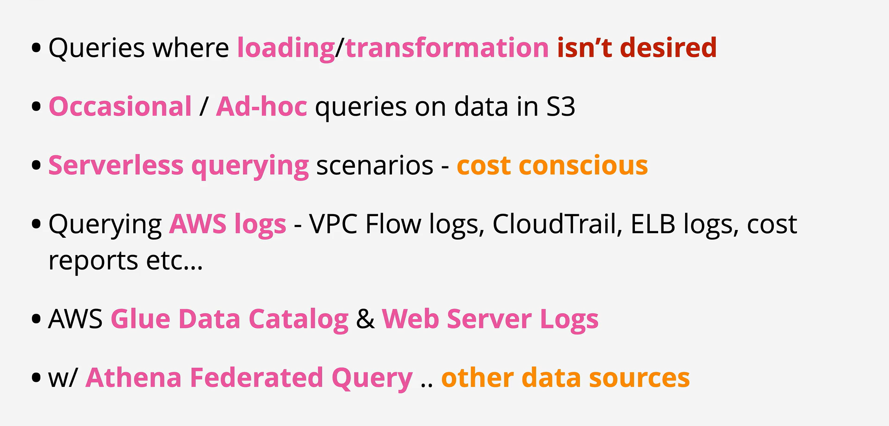

- Amazon Athena is serverless querying service which allows for ad-hoc questions where billing is based on the amount of data consumed.

- Athena is an underrated service capable of working with unstructured, semi-structured or structured data.

 
 
 
 
 