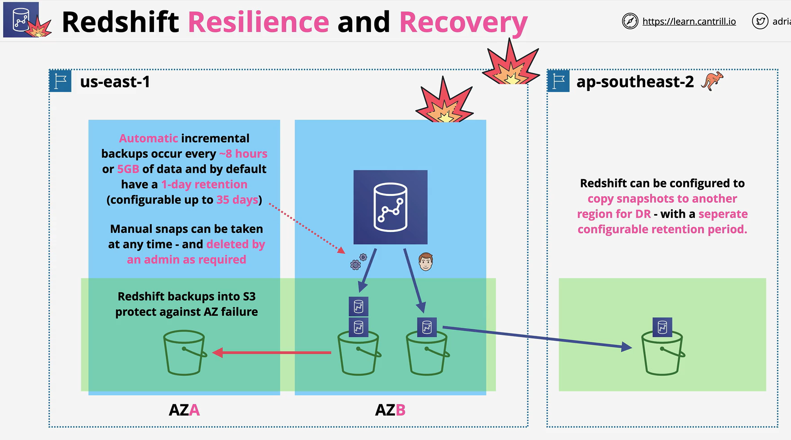

- Redshift is a column based, petabyte scale, data warehousing product within AWS

- Its designed for OLAP products within AWS/on-premises to add data to for long term processing, aggregation and trending.

 

 