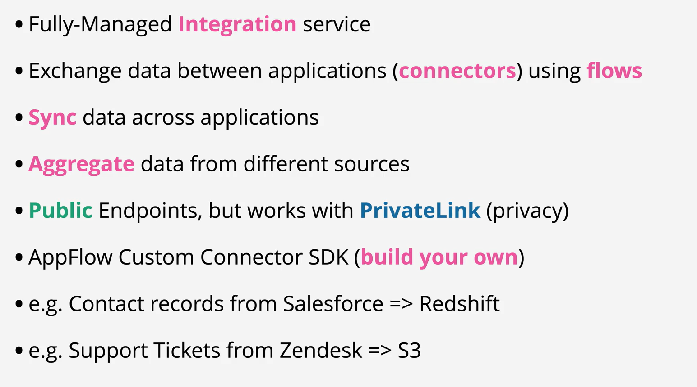

- Amazon AppFlow is a fully managed integration service that enables you to securely transfer data between Software-as-a-Service (SaaS) applications like Salesforce, SAP, Zendesk, Slack, and ServiceNow, and AWS services like Amazon S3 and Amazon Redshift, in just a few clicks.
- With AppFlow, you can run data flows at enterprise scale at the frequency you choose - on a schedule, in response to a business event, or on demand.
- You can configure data transformation capabilities like filtering and validation to generate rich, ready-to-use data as part of the flow itself, without additional steps.
- AppFlow automatically encrypts data in motion, and allows users to restrict data from flowing over the public Internet for SaaS applications that are integrated with AWS PrivateLink, reducing exposure to security threats.

 
 