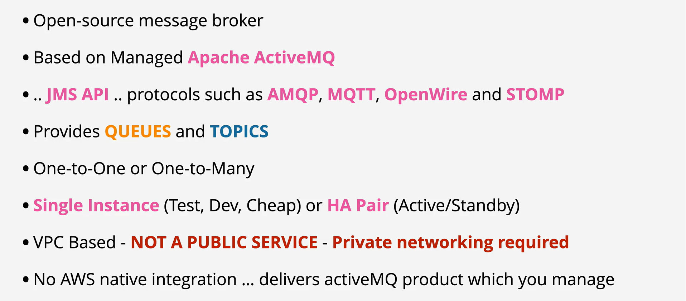

- AmazonMQ is an AWS implementation of Apache ActiveMQ

- It supports open standards such as JMS, AMQP, MQTT, OpenWire and STOMP

- If you need to support any of these, and use queues and topics - AmazonMQ is the tool to use.

 
 