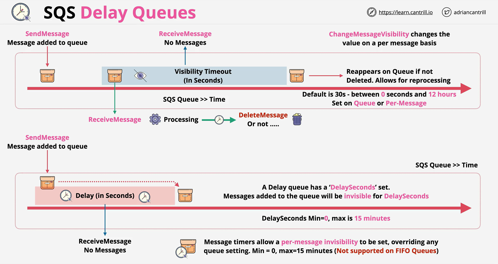

- Dead letter queues allow for messages which are causing repeated processing errors to be moved into a dead letter queue

- in this queue, different processing methods, diagnostic methods or logging methods can be used to identity message faults

 
 
 
 
 
 
 
 
 
 
 
 
 
 
 
 
 