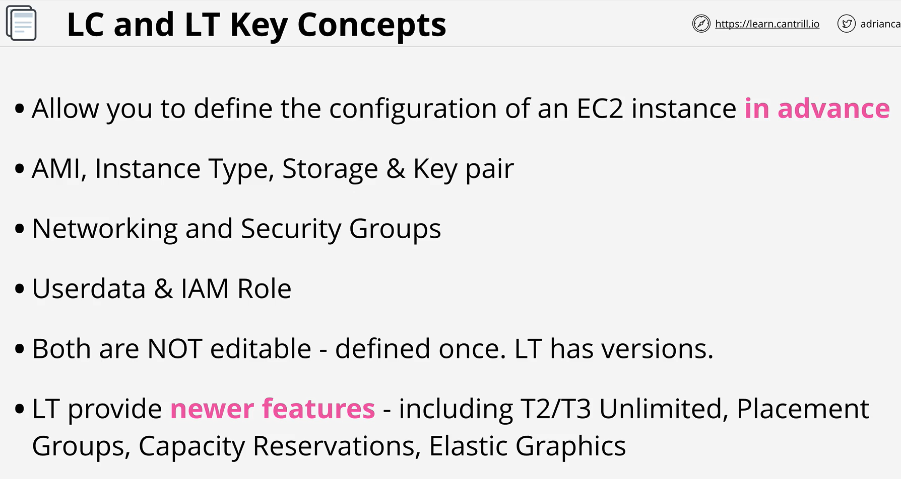
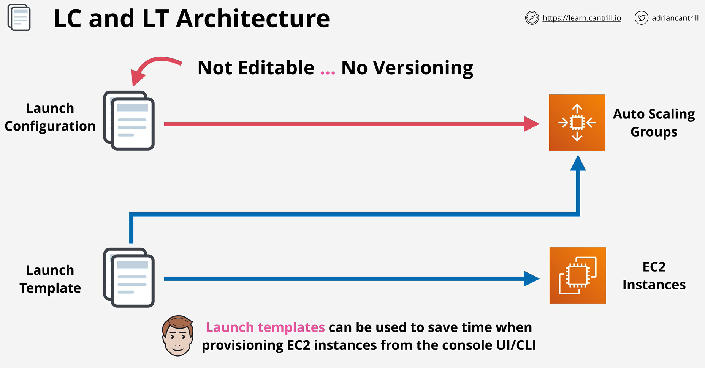
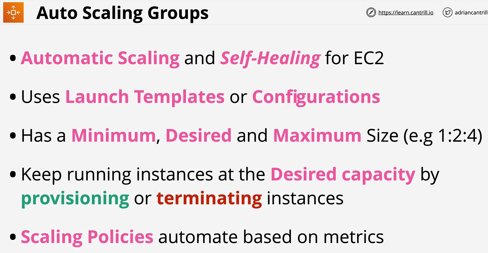
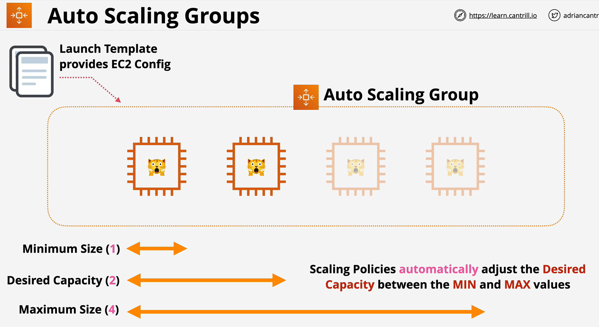
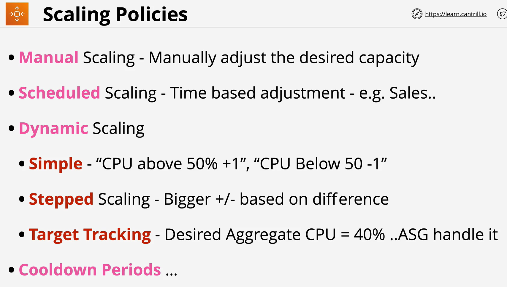
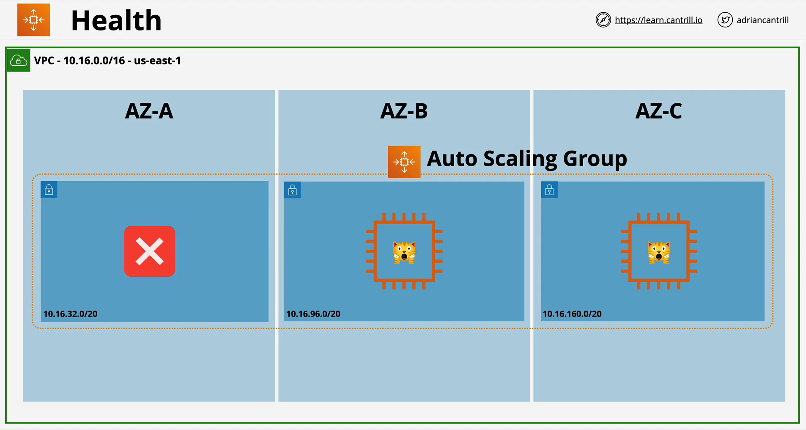
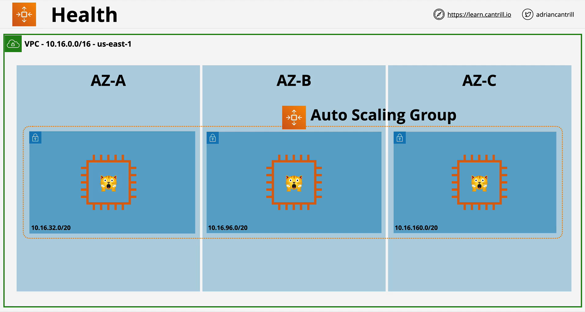
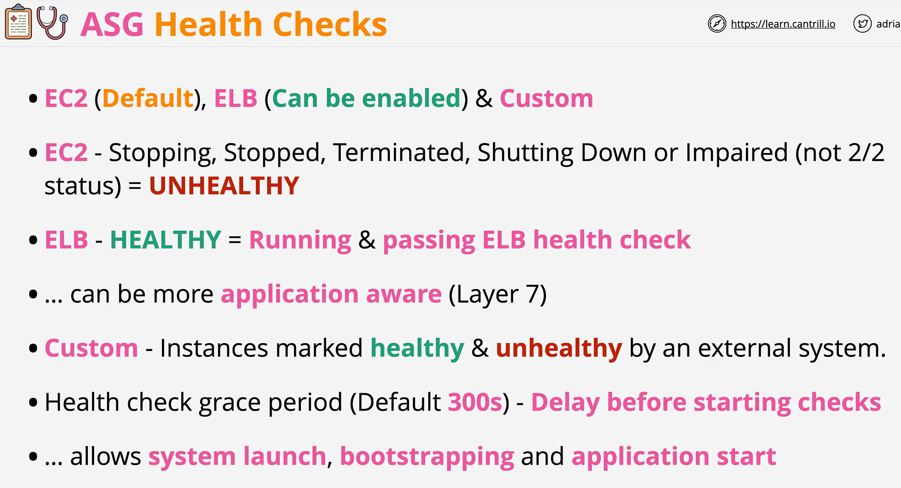

 

- Launch Configurations and Launch Templates provide the WHAT to Auto scaling groups.

- They define WHAT gets provisioned

- The AMI, the Instance Type, the networking & security, the key pair to use, the userdata to inject and IAM Role to attach.

- An Auto Scaling group contains a collection of Amazon EC2 instances that are treated as a logical grouping for the purposes of automatic scaling and management.

- An Auto Scaling group also enables you to use Amazon EC2 Auto Scaling features such as health check replacements and scaling policies.

- Both maintaining the number of instances in an Auto Scaling group and automatic scaling are the core functionality of the Amazon EC2 Auto Scaling service.

- With step scaling and simple scaling, you choose scaling metrics and threshold values for the CloudWatch alarms that trigger the scaling process.
- You also define how your Auto Scaling group should be scaled when a threshold is in breach for a specified number of evaluation periods.
- Step scaling policies and simple scaling policies are two of the dynamic scaling options available for you to use.
- Both require you to create CloudWatch alarms for the scaling policies.
- Both require you to specify the high and low thresholds for the alarms.
- Both require you to define whether to add or remove instances, and how many, or set the group to an exact size. 
- The main difference between the policy types is the step adjustments that you get with step scaling policies.
- When step adjustments are applied, and they increase or decrease the current capacity of your Auto Scaling group, the adjustments vary based on the size of the alarm breach.

- Lifecycle hooks enable you to perform custom actions by pausing instances as an Auto Scaling group launches or terminates them.
- When an instance is paused, it remains in a wait state either until you complete the lifecycle action using the complete-lifecycle-action command or the CompleteLifecycleAction operation, or until the timeout period ends (one hour by default).

- Amazon EC2 Auto Scaling can determine the health status of an instance using one or more of the following:
- Status checks provided by Amazon EC2 to identify hardware and software issues that may impair an instance.
- The default health checks for an Auto Scaling group are EC2 status checks only.
- Health checks provided by Elastic Load Balancing (ELB). These health checks are disabled by default but can be enabled.
- Your custom health checks.

- SSL Bridging
- SSL Pass Through
- SSL Offloading

