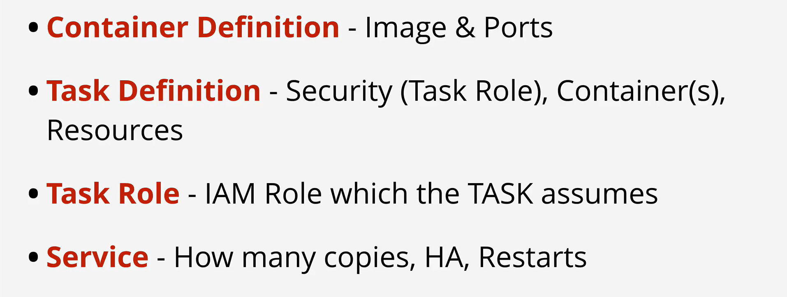
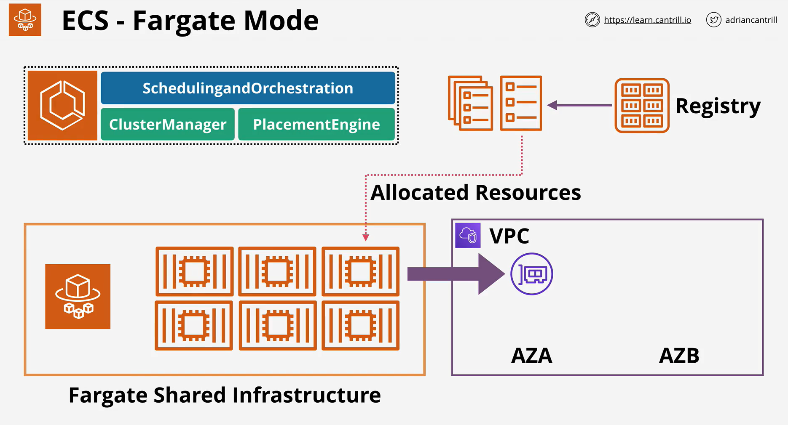

- ECS is capable of running in EC2 mode or Fargate mode.

- EC2 mode deploys EC2 instances into your AWS account which can be used to deploy tasks and services.

- With EC2 mode you pay for the EC2 instances regardless of container usage

- Fargate mode uses shared AWS infrastructure, and ENI's which are injected into your VPC

- You pay only for container resources used while they are running.

 

 
 

 

 

 