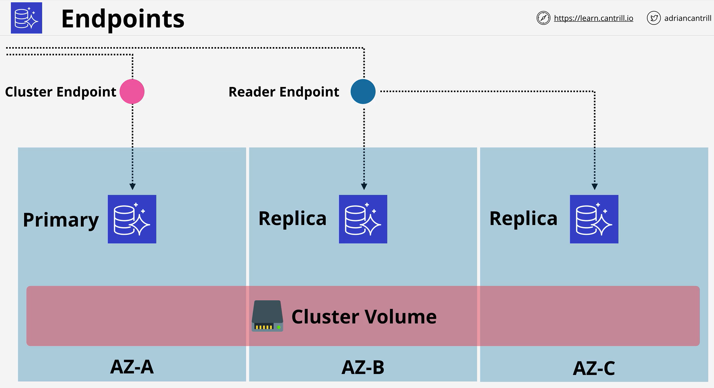
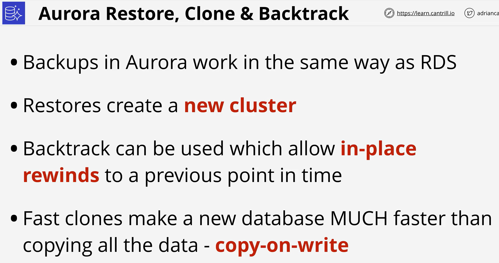
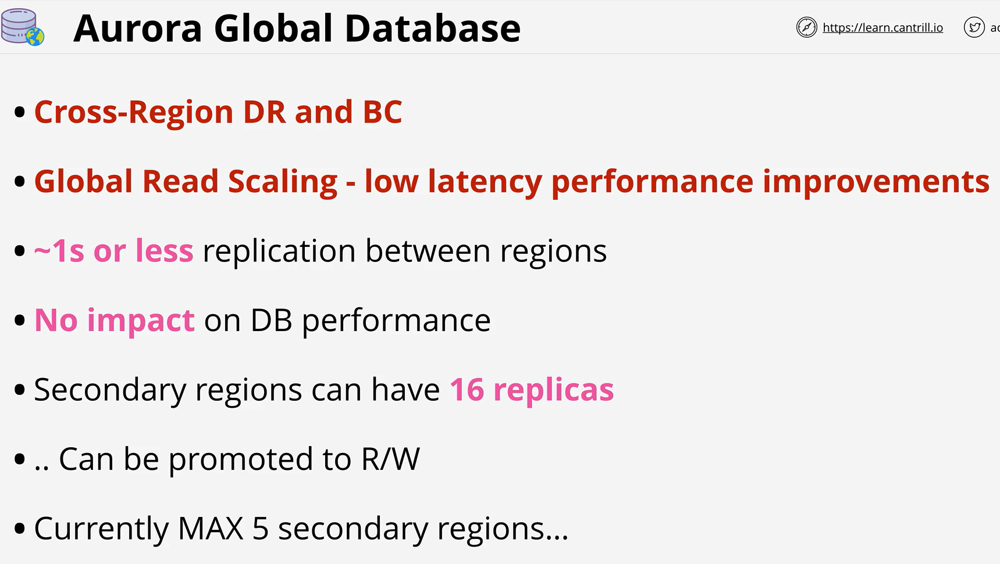
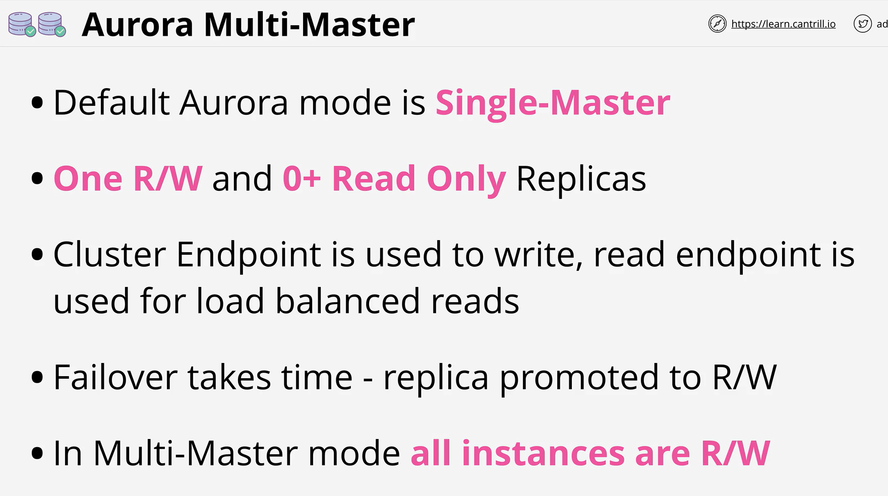
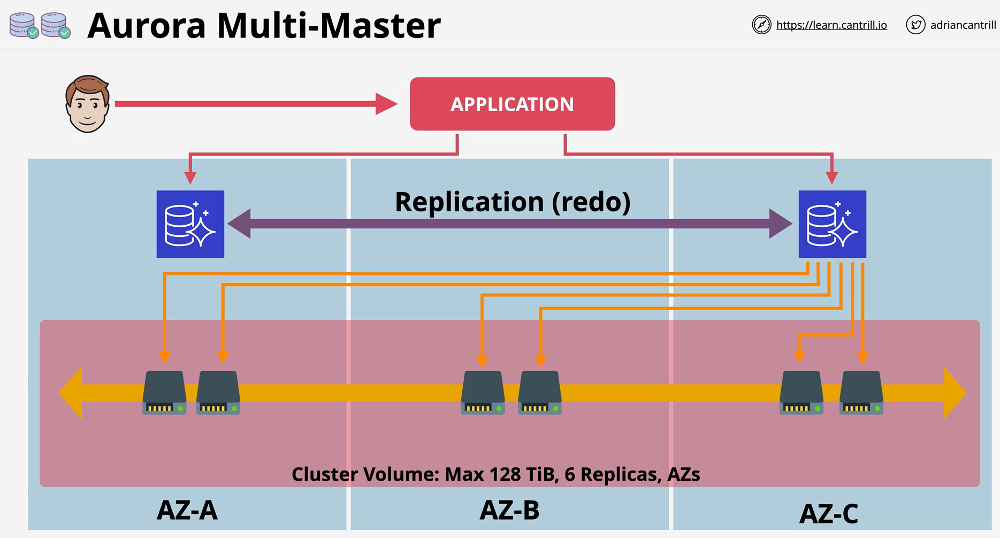
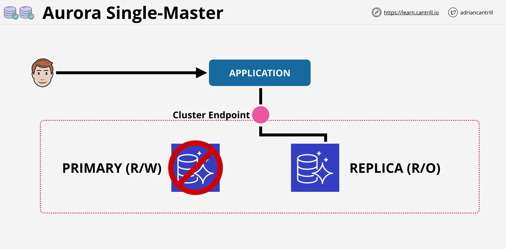

- Aurora is a AWS designed database engine officially part of RDS

- Aurora implements a number of radical design changes which offer significant performance and feature improvements over other RDS database engines.

 

 

 

 

 

 

- Aurora global databases are a feature of Aurora Provisioned clusters which allow data to be replicated globally providing significant RPO and RTO improvements for BC and DR planning. Additionally global databases can provide performance improvements for customers .. with data being located closer to them, in a read-only form.

- Replication occurs at the storage layer and is generally ~1second between all AWS regions.

- Multi-master write is a mode of Aurora Provisioned Clusters which allows multiple instances to perform reads and writes at the same time - rather than only one primary instance having write capability in a single-master cluster. This lesson steps through the architecture and explains how the conflict resolution works.

