- DynamoDB is a NoSQL fully managed Database-as-a-Service (DBaaS) product available within AWS.

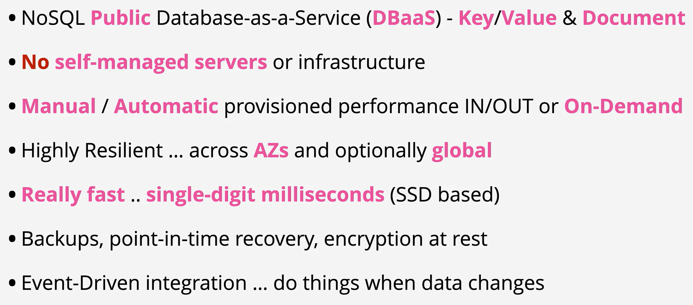

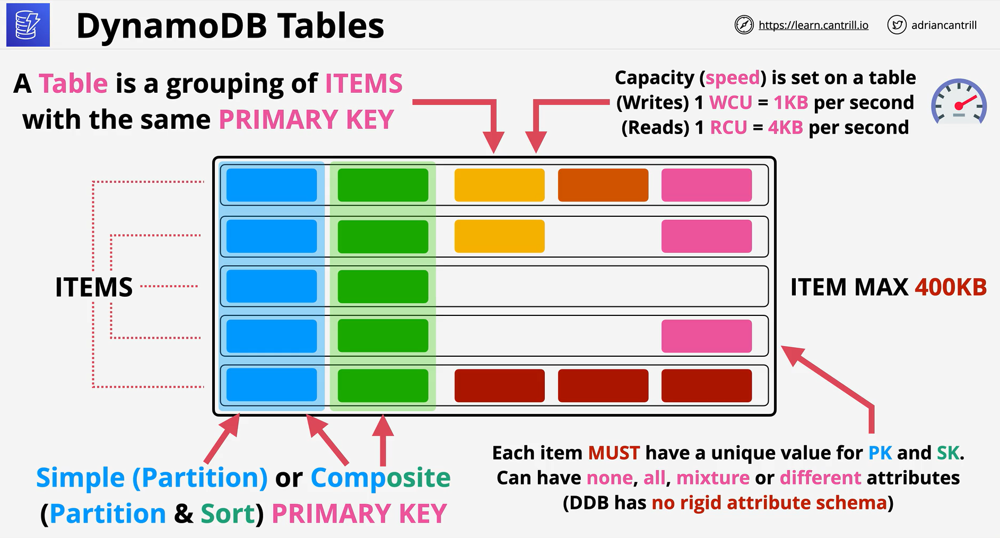

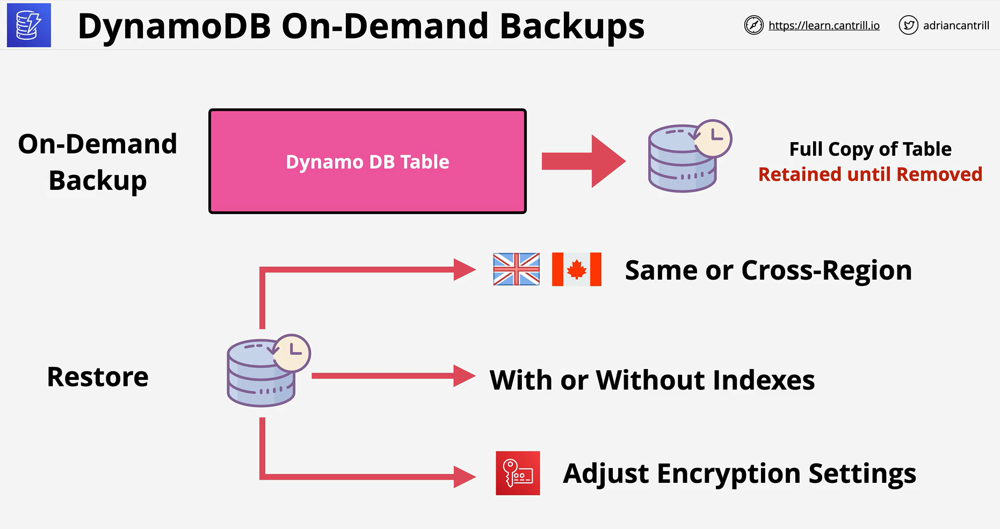

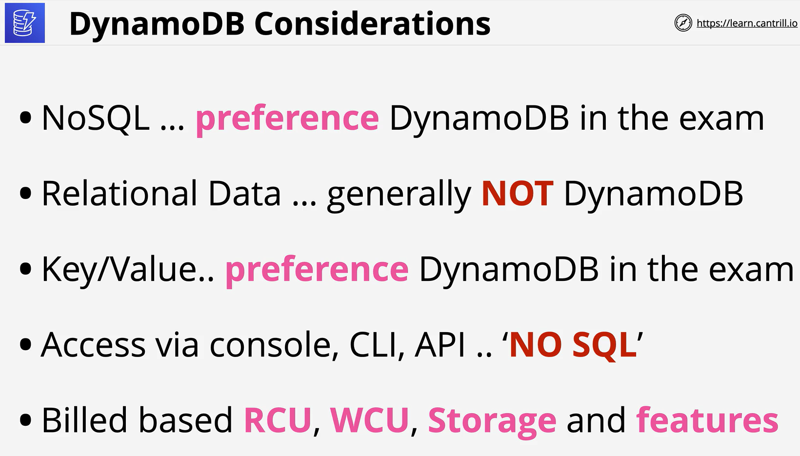

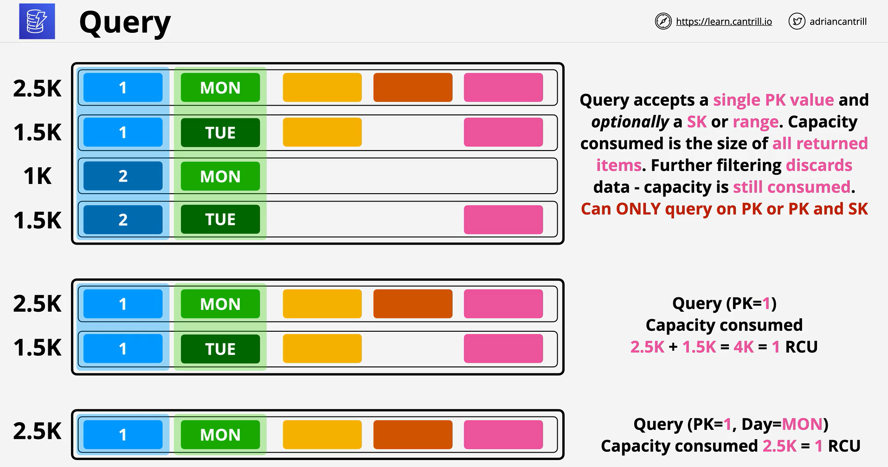

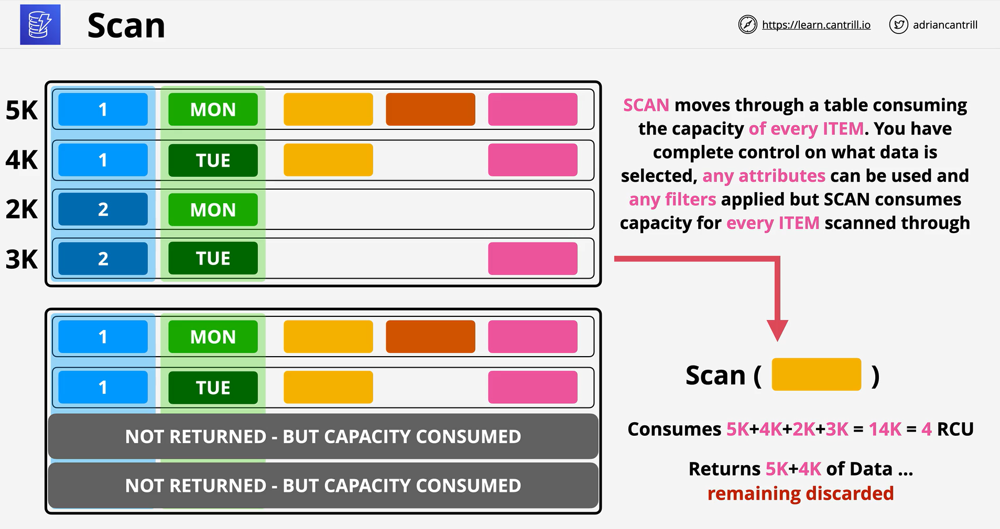

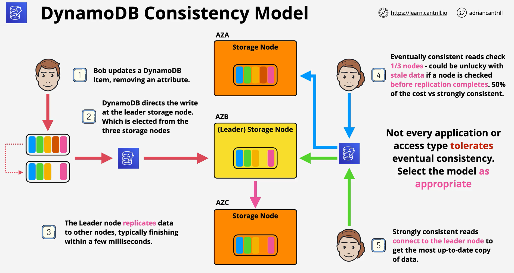

- Local Secondary Indexes (LSI) and Global Secondary Indexes (GSI) allow for an alternative presentation of data stored in a base table.

- LSI allow for alternative SK's whereas with GSIs you can use alternative PK and SK.

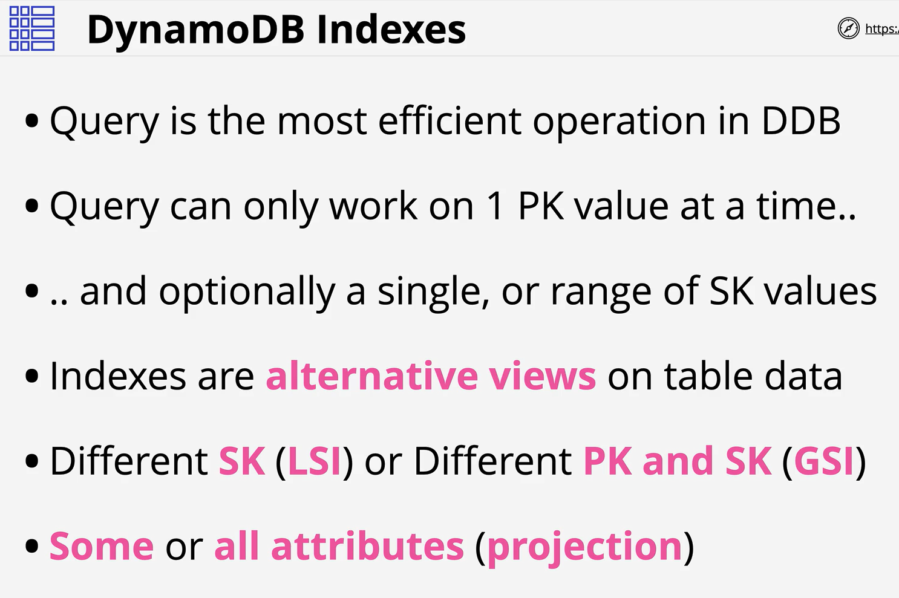

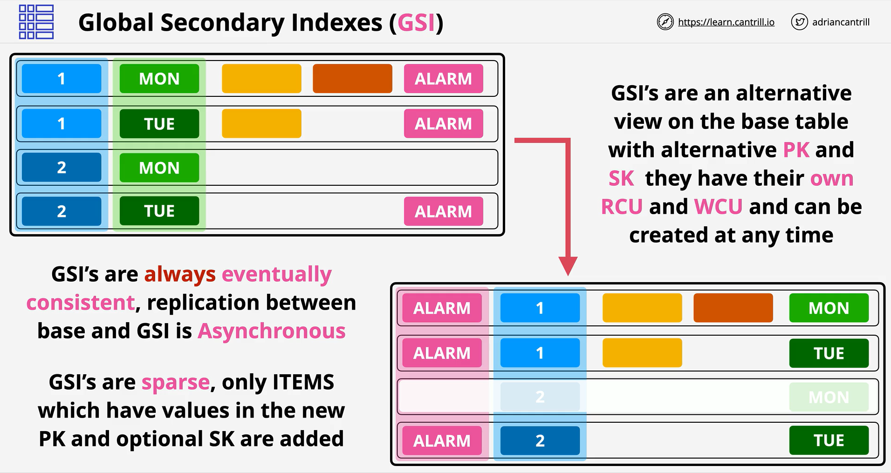

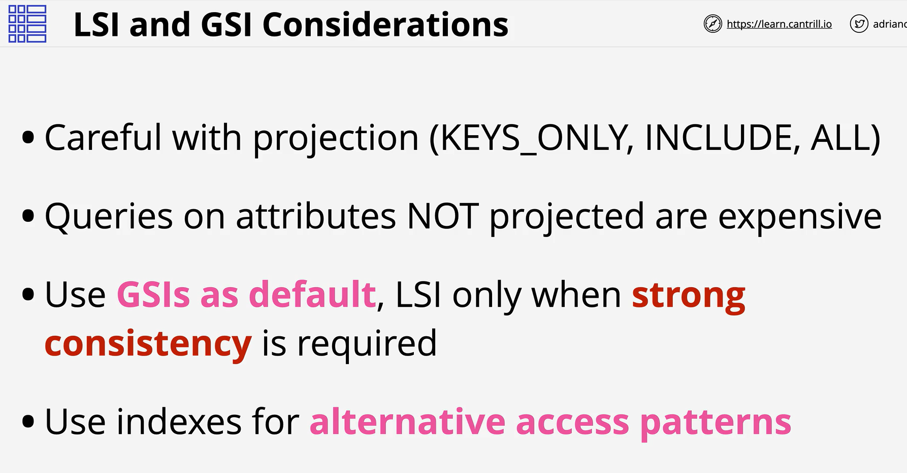

- DynamoDB Streams are a 24 hour rolling window of time ordered changes to ITEMS in a DynamoDB table

- Streams have to be enabled on a per table basis , and have 4 view types

- KEYS_ONLY

- NEW_IMAGE

- OLD_IMAGE

- NEW_AND_OLD_IMAGES

- Lambda can be integrated to provide trigger functionality - invoking when new entries are added on the stream.

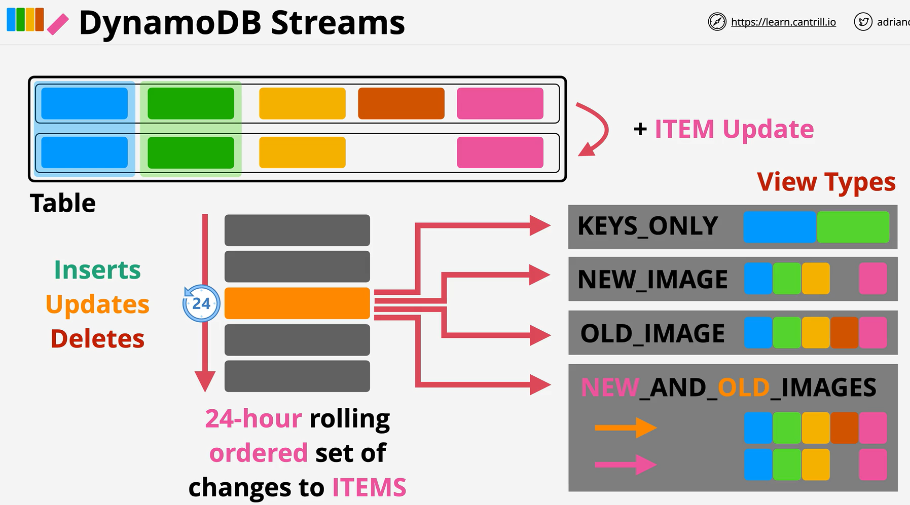

- DynamoDB Global Tables provides multi-master global replication of DynamoDB tables which can be used for performance, HA or DR/BC reasons.

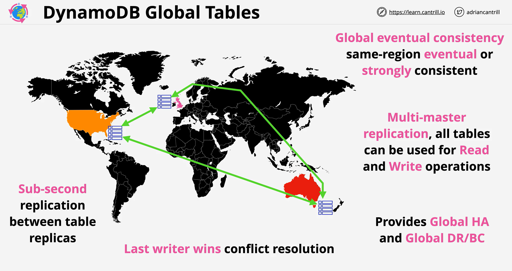

- DynamoDB Accelerator (DAX) is an in-memory cache designed specifically for DynamoDB. It should be your default choice for any DynamoDB caching related questions.

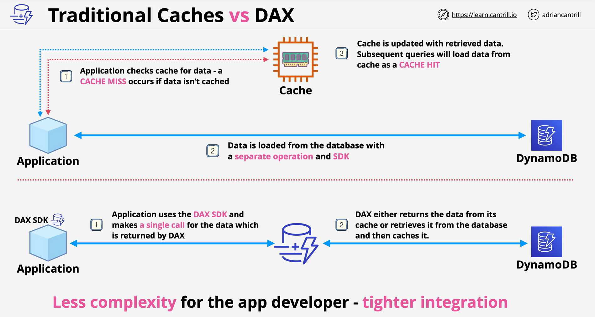

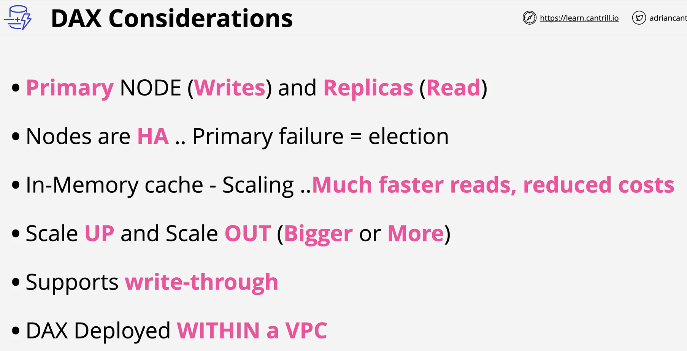

- Amazon DynamoDB Time to Live (TTL) allows you to define a per-item timestamp to determine when an item is no longer needed.
- Shortly after the date and time of the specified timestamp, DynamoDB deletes the item from your table without consuming any write throughput. TTL is provided at no extra cost as a means to reduce stored data volumes by retaining only the items that remain current for your workload’s needs

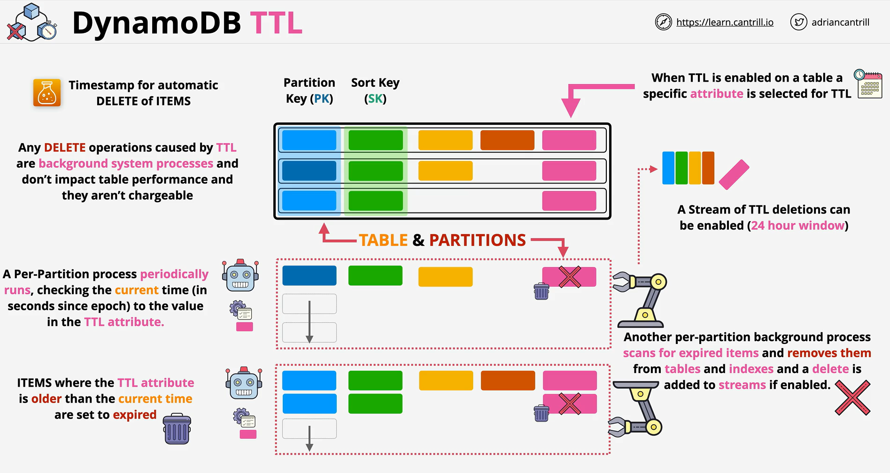

 

 
 
 
 
 
 
 
 
 
 
 
 
 
 
 
 
 
 
 