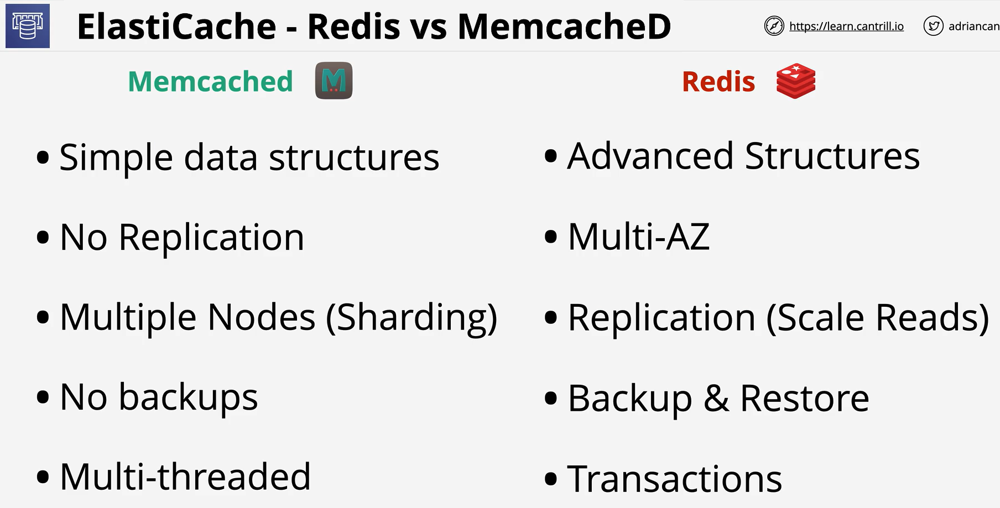

- Elasticache is a managed in-memory cache which provides a managed implementation of the redis or memcached engines.

- its useful for read heavy workloads, scaling reads in a cost effective way and allowing for externally hosted user session state.

 

 
 