- The Relational Database Service (RDS) is a Database(server) as a service product from AWS which allows the creation of managed databases instances.

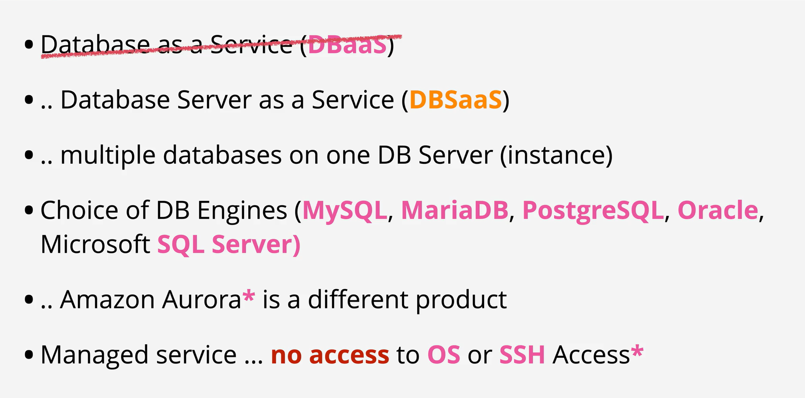

- MultiAZ is a feature of RDS which provisions a highly available instance set.

- The product provides MultiAZ instance .. where a standby replica is kept in sync Synchronously with the primary instance.The standby replica cannot be used for any performance scaling ... only availability.

- it also provides MultiAZ cluster mode, where a write and two reader instances are kept in sync Synchronously. The reader instances can be used for read operations ..allowing for limited read scaling.

- Backups, software updates and restarts can take advantage of MultiAZ to reduce user disruption.

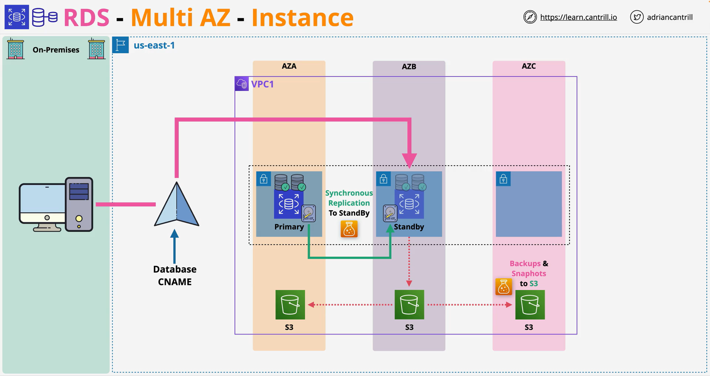

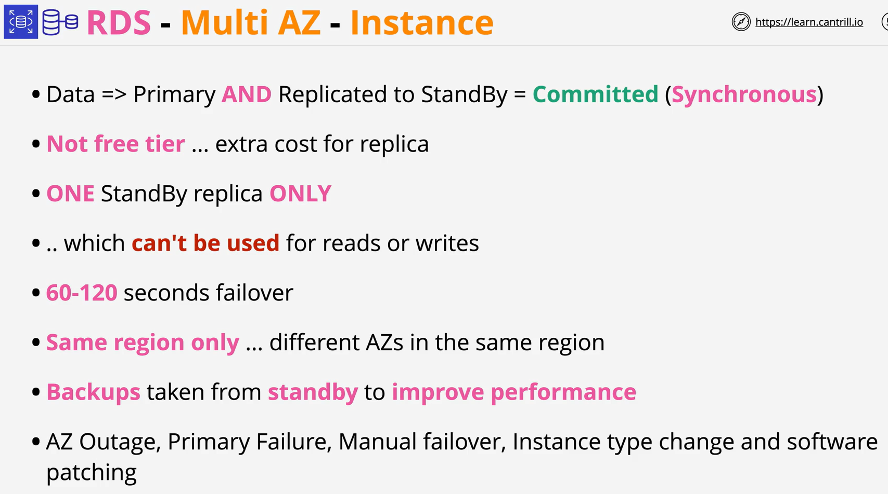

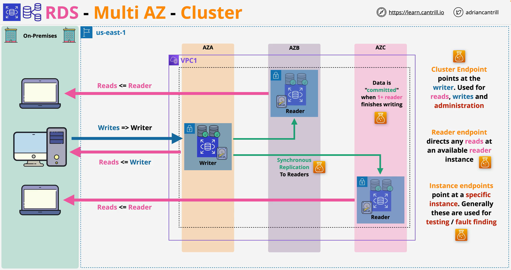

- RDS is capable of performing Manual Snapshots and Automatic backups

- Manual snapshots are performed manually and live past the termination of an RDS instance

- Automatic backups can be taken of an RDS instance with a 0 (Disabled) to 35 Day retention.

- Automatic backups also use S3 for storing transaction logs every 5 minutes - allowing for point in time recovery.

- Snapshots can be restored .. but create a new RDS instance.

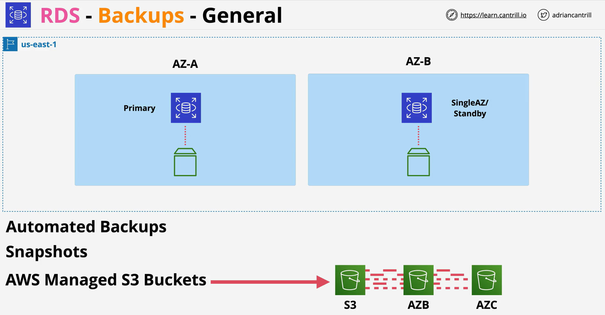

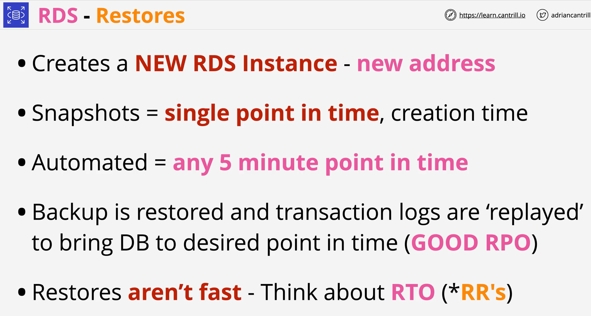

- RDS Read Replicas can be added to an RDS Instance - 5 direct per primary instance.

- They can be in the same region, or cross-region replicas.

- They provide read performance scaling for the instance, but also offer low RTO recovery for any instance failure issues

- N.B they don't help with data corruption as the corruption will be replicated to the RR.

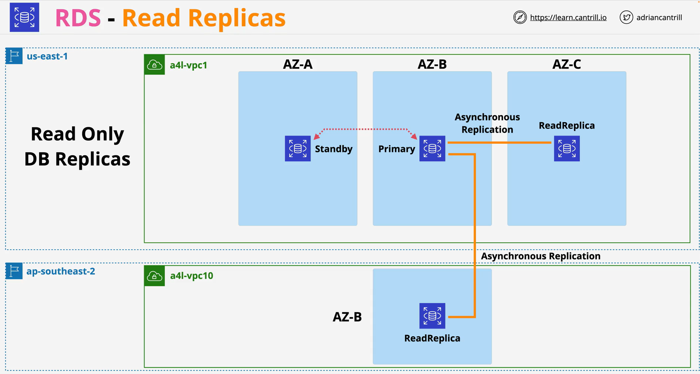

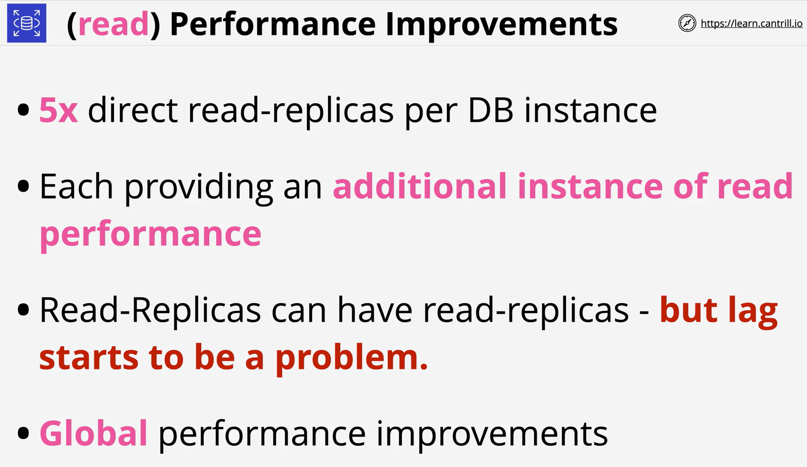

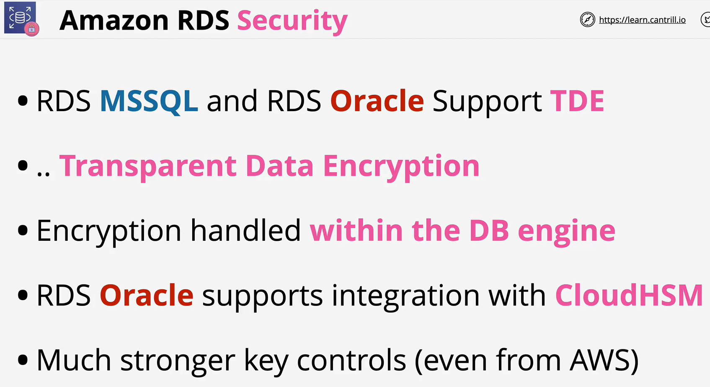

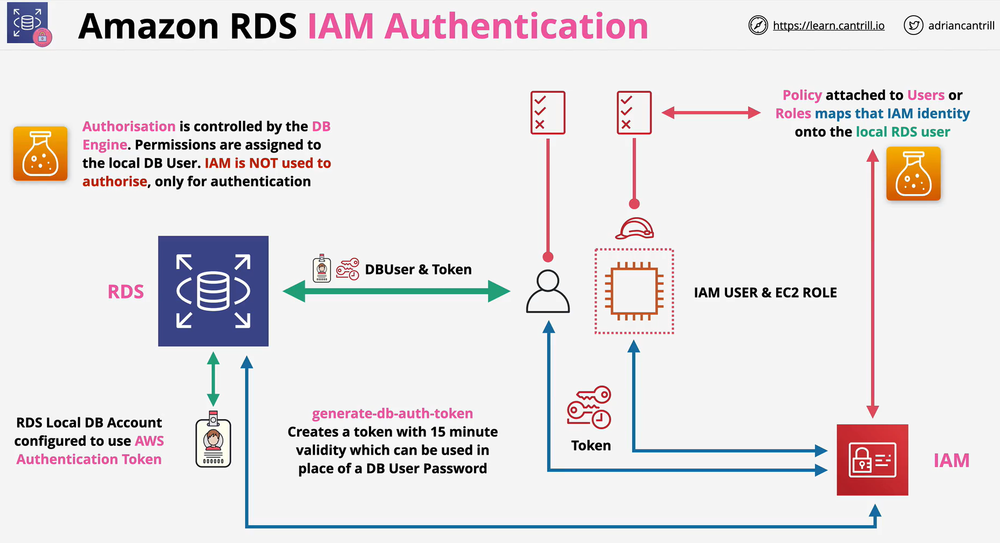

- Amazon RDS Custom is a managed database service for applications that require customization of the underlying operating system and database environment.

- Benefits of RDS automation with the access needed for legacy, packaged, and custom applications.

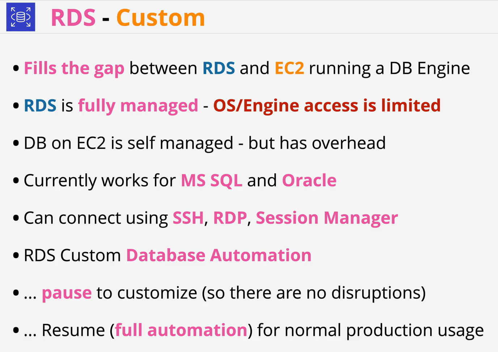

- Amazon RDS Proxy is a fully managed, highly available database proxy for Amazon Relational Database Service (RDS) that makes applications more scalable, more resilient to database failures, and more secure.

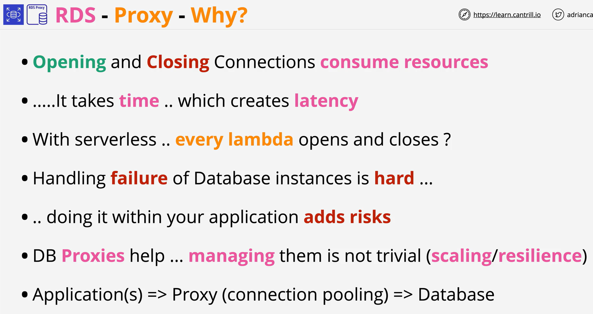

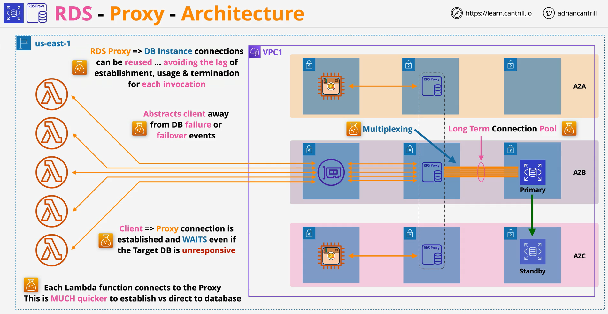

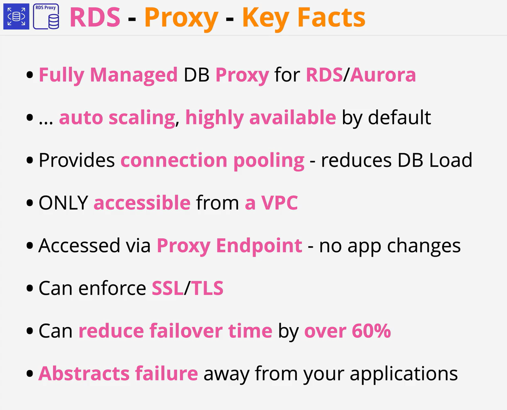

 

 
 
 
 
 
 
 
 
 
 
 
 
 
 
 
 
 
 
 
 
 
 
 
 
 
 