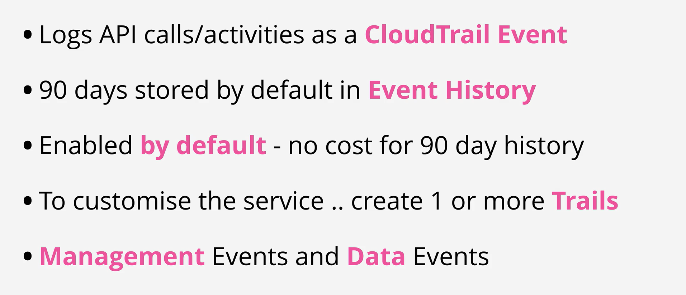
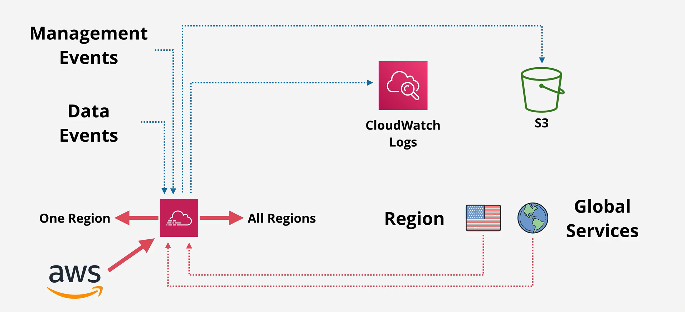
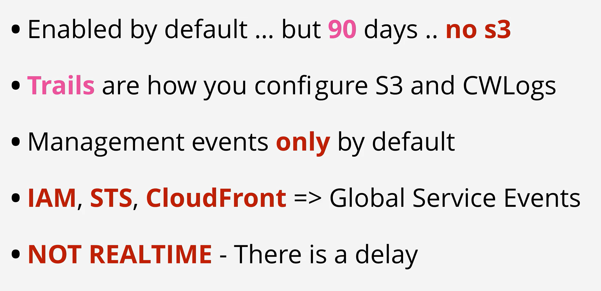

- CloudTrail Is a product which logs API calls and account events.

- It's very often used to diagnose security or performance issues, or to provide quality account level traceability.

- It is enabled by default in AWS accounts and logs free information with a 90 day retention.

- It can be configured to store data indefinitely in S3 or CloudWatch Logs

