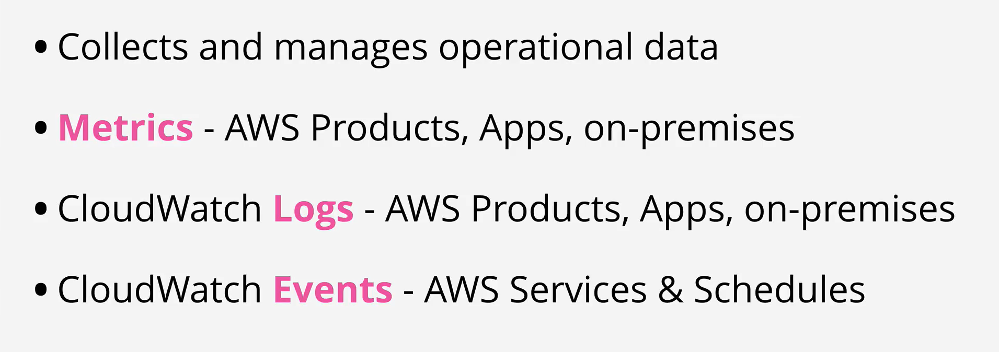
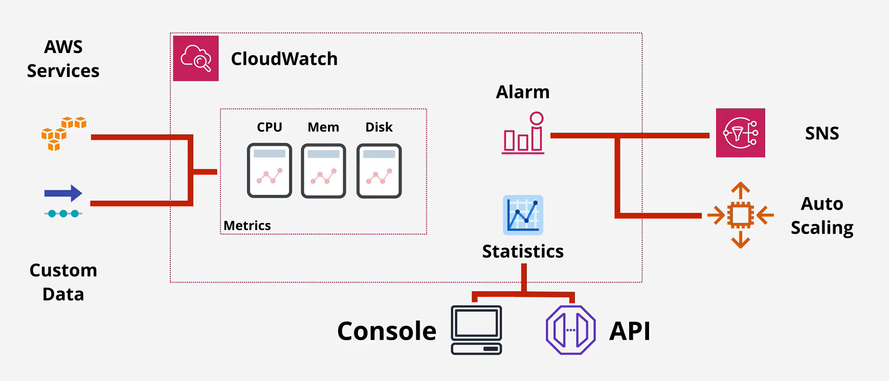
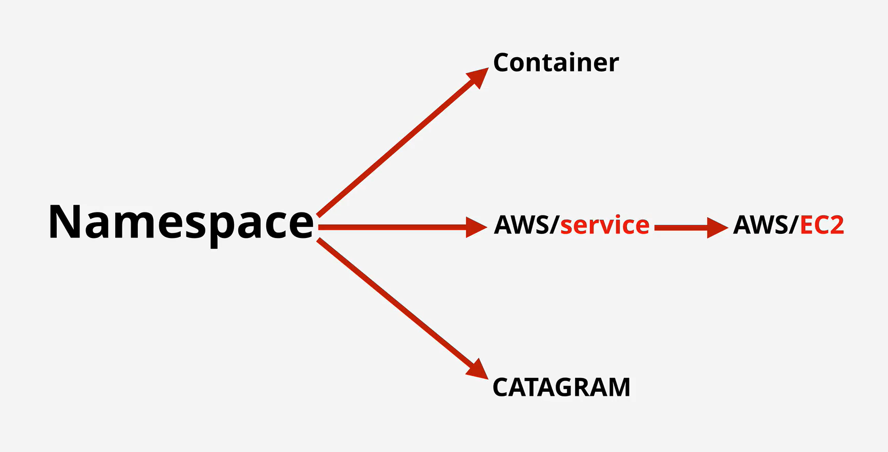
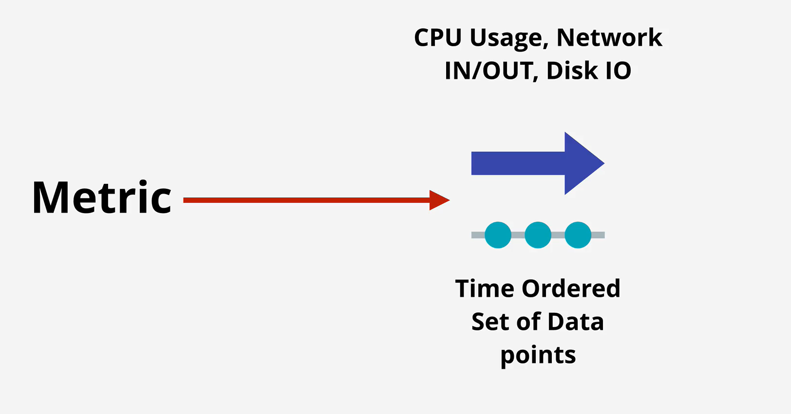
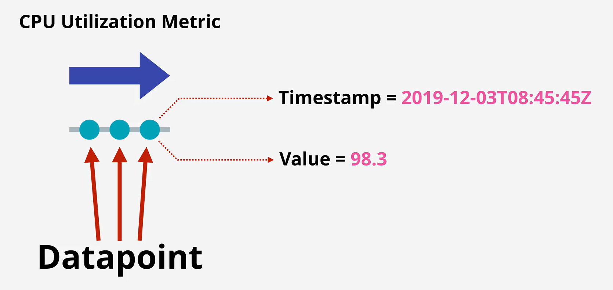
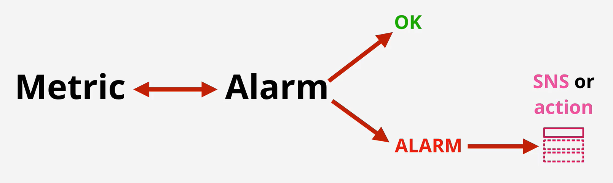
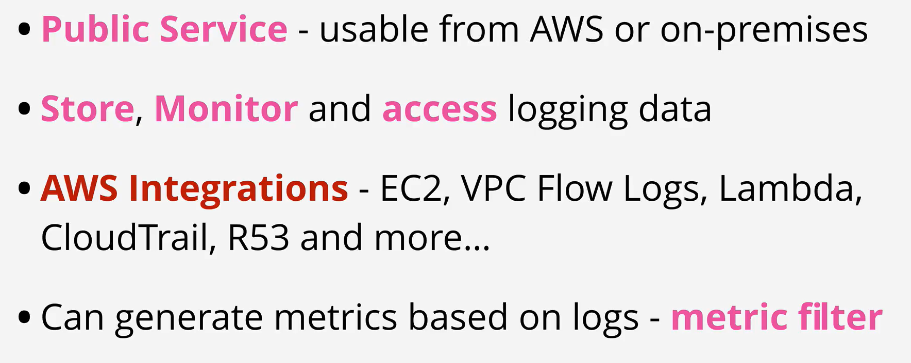
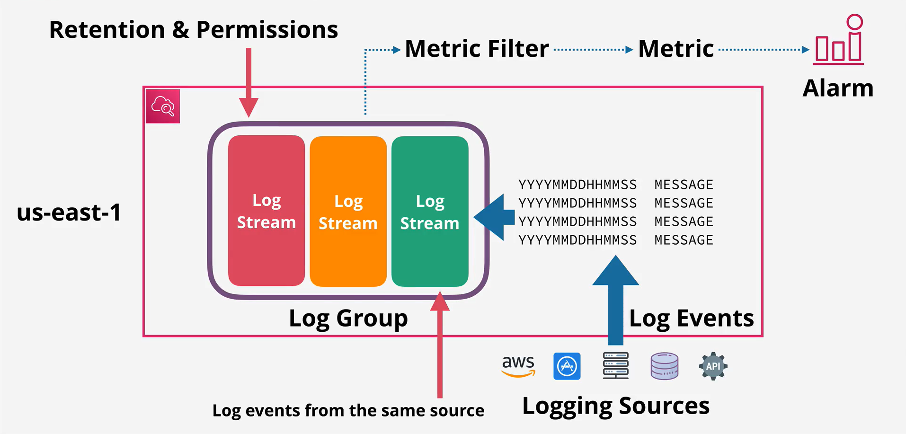

- CloudWatch is a core supporting service within AWS which provides metric, log and event management services.

- It's used through other AWS services for health and performance monitoring, log management and nerveless architectures.

- CloudWatch Logs is a service which can accept logging data, store it and monitor it.

- It is often the default place where AWS Services can output their logging too.

- CloudWatch Logs is a public service and can also be utilised in an on-premises environment and even from other public cloud platforms.

