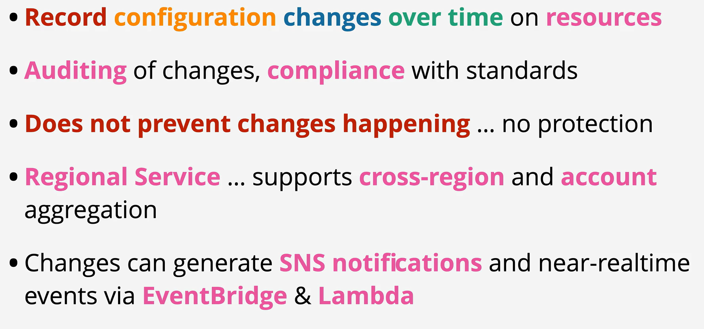

- AWS Config is a service which records the configuration of resources over time (configuration items) into configuration histories.

- All the information is stored regionally in an S3 config bucket.

- AWS Config is capable of checking for compliance .. and generating notifications and events based on compliance.

