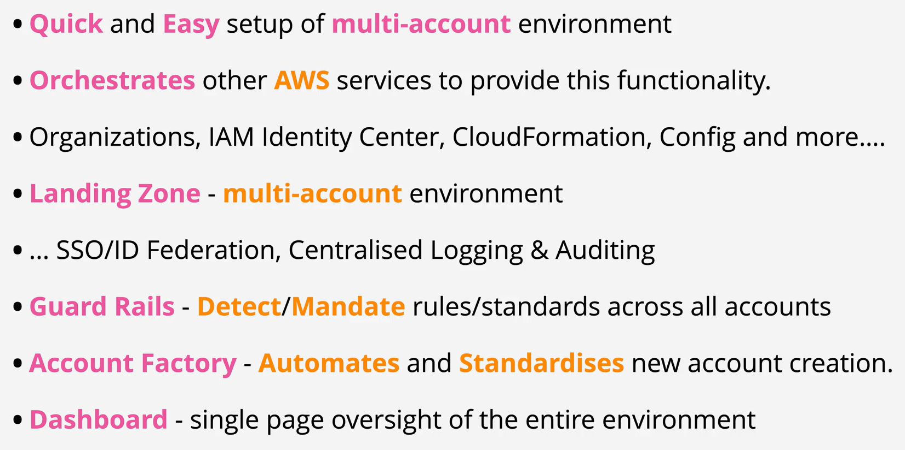
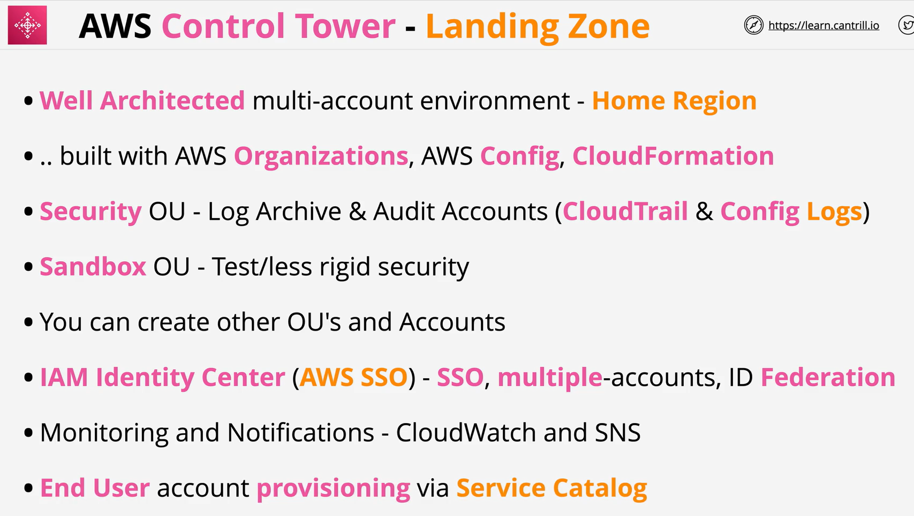
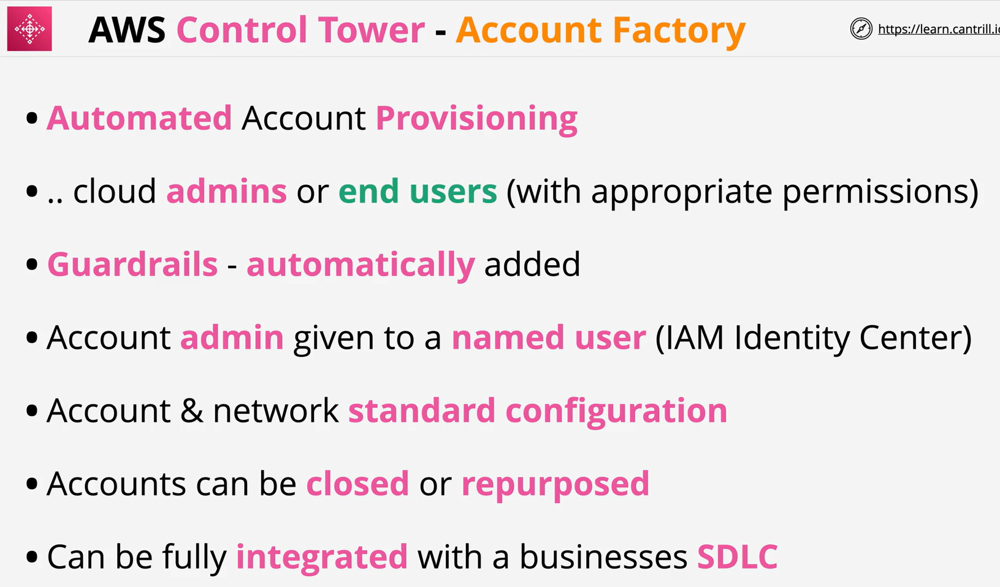

- AWS Control Tower offers a straightforward way to set up and govern an AWS multi-account environment, following prescriptive best practices.
- AWS Control Tower orchestrates the capabilities of several other AWS services, including AWS Organizations, AWS Service Catalog, and AWS IAM Identity Center (successor to AWS Single Sign-On), to build a landing zone in less than an hour. Resources are set up and managed on your behalf.

- AWS Control Tower orchestration extends the capabilities of AWS Organizations.
- To help keep your organizations and accounts from drift, which is divergence from best practices, AWS Control Tower applies preventive and detective controls (guardrails). For example, you can use guardrails to help ensure that security logs and necessary cross-account access permissions are created, and not altered.

 

 
 
 
 
 
 
 